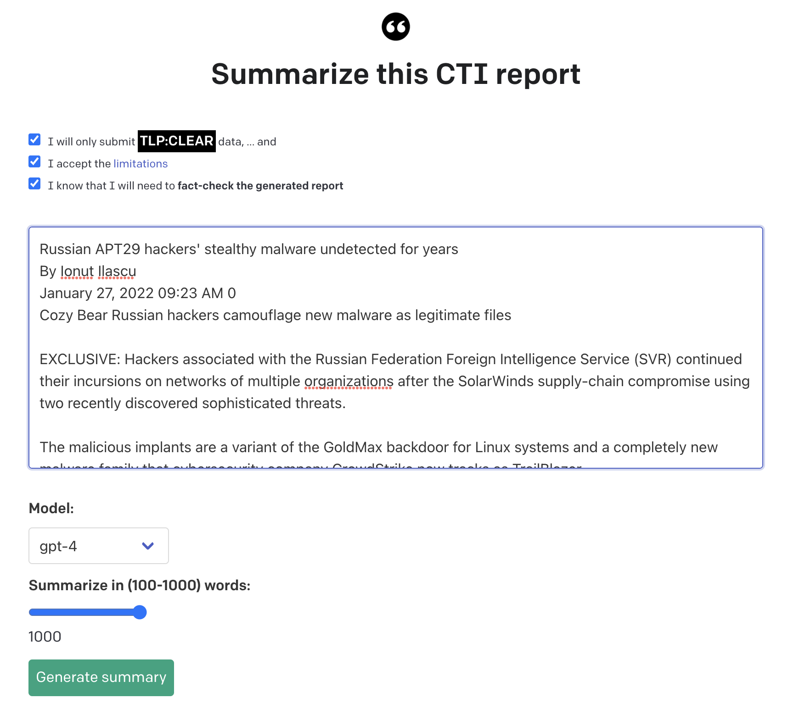
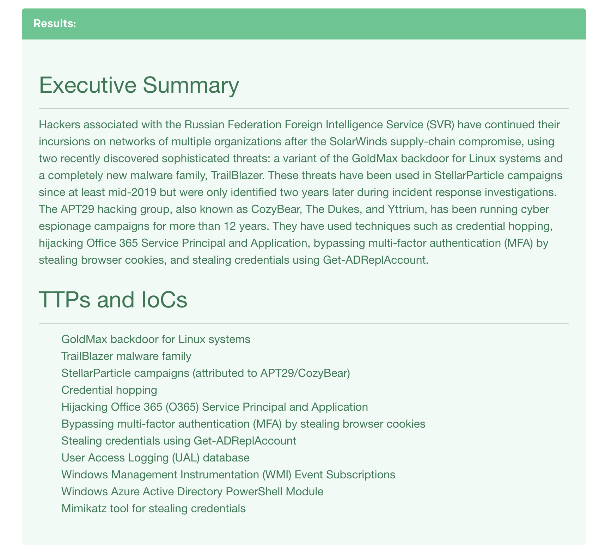

# OpenAI and FastAPI - Text summarization 

This text summarizer is a web based frontend for summarising (Cyber Threat Intelligence]() (CTI) reports.
It uses OpenAI's GPT3.5 and GPT4 API to generate meaningful summaries for management as well as for extracting IP addresses, domains, URLs, hashes etc from a CTI report.

Input:




Output:




This code is losely based on [Oikosohn's](https://github.com/oikosohn/openai-quickstart-fastapi) openai quickstart fastapi repo, which in turn was based on [openai-quickstart-python](https://github.com/openai/openai-quickstart-python).


It uses the OpenAI API [quickstart tutorial](https://beta.openai.com/docs/quickstart) and the [FastAPI](https://fastapi.tiangolo.com/) web framework. 

With prompt engineering, we ask openai's gpt-4 model to summarize a CTI text for upper management.

**Note**: you will have to get your own API key for this.


## Setup

1. First make a copy of the example environment variables file

   ```bash
   # Linux
   $ cp env.example .env
   ```

   ```shell
   # Windows
   xcopy .env.example .env
   ```

2. Add your [API key](https://beta.openai.com/account/api-keys) to the newly created `.env` file
   *Note*: when coding, you might want to not send a request to openai for every page reload. In that case, set `DRY_RUN=1` in `.env`.


3. Then build the image:

```bash
docker build -t openai-summarizer:0.1 . --network=host
```

(The .env file will be copied into the image as well)


4. Run the dockerized app

   ```bash
   $  docker compose up -d
   ```
   

You should now be able to access the app at [http://localhost:9999](http://localhost:9999)! 


## Reference

- [openai/openai-quickstart-python](https://github.com/openai/openai-quickstart-python)
- [Oikosohn's fastapi openai demo](https://github.com/oikosohn/openai-quickstart-fastapi)

